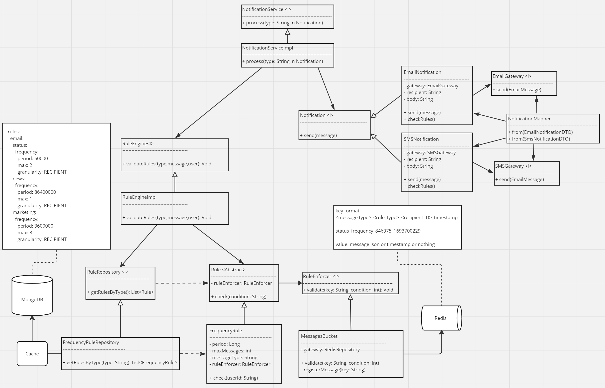

# Modak Technical Exercise
## Juan Pablo Fregossi
## Rate-Limited Notification Service

Modak technical exercise: Rate-Limited Notification Service
Refere to REQUIREMENTS.md for details

## Prerequisites

- Docker and docker compose installed on your machine. If you don't have Docker installed, you can get it from [Docker's official site](https://docs.docker.com/get-docker/).

## Running the Application using Docker

1. **Clone the Repository**:

   ```sh
   git clone https://github.com/jpfregossi/modak-te.git
   cd modak-te

2. **Build and run the Docker Images**:

   ```sh
   docker compose up

This will create a Docker images named notification-service, mongodb and redis.

4. **Access the Application**:

   If running on Linux, use the following `curl` command to make a POST request to the application:

   ```sh
   curl --location 'http://localhost:8080/api/v1/notifications/email/status' \
        --header 'Content-Type: application/json' \
        --data-raw '{
        "name": "Juan Pablo",
        "subject": "mensaje de status",
        "email": "jpfregossi@gmail.com",
        "message": "status message"
        }'
   ```

### Refernce Diagram



